<h1 align="center">⚔️ Edict · Multi-Agent Orchestration</h1>

<p align="center">
  <strong>I modeled an AI multi-agent system after China's 1,300-year-old imperial governance.<br>Turns out, ancient bureaucracy understood separation of powers better than modern AI frameworks.</strong>
</p>

<p align="center">
  <sub>12 AI agents (11 business roles + 1 compatibility role) form the Three Departments & Six Ministries: Crown Prince triages, Planning proposes, Review vetoes, Dispatch assigns, Ministries execute.<br>Built-in <b>institutional review gates</b> that CrewAI doesn't have. A <b>real-time dashboard</b> that AutoGen doesn't have.</sub>
</p>

<p align="center">
  <a href="#-demo">🎬 Demo</a> ·
  <a href="#-quick-start">🚀 Quick Start</a> ·
  <a href="#-architecture">🏛️ Architecture</a> ·
  <a href="#-features">📋 Features</a> ·
  <a href="README.md">中文</a> ·
  <a href="CONTRIBUTING.md">Contributing</a>
</p>

<p align="center">
  
  
  
  
  
  
</p>

<p align="center">
  
</p>

---

## 🎬 Demo

<p align="center">
  <video src="docs/media/Agent_video_Pippit_20260225121727.mp4" width="100%" autoplay muted loop playsinline controls>
    Your browser does not support video playback. See the GIF below or <a href="docs/media/Agent_video_Pippit_20260225121727.mp4">download the video</a>.
  </video>
  <br>
  <sub>🎥 Full demo: AI Multi-Agent collaboration with Three Departments & Six Ministries</sub>
</p>

<details>
<summary>📸 GIF Preview (loads faster)</summary>
<p align="center">
  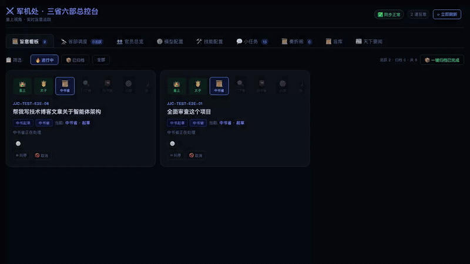
  <br>
  <sub>Issue edict → Crown Prince triage → Planning → Review → Ministries execute → Report back (30s)</sub>
</p>
</details>

> 🐳 **No OpenClaw?** Run `docker compose up -d --build`, then open `http://127.0.0.1:8002` to try the v2 dashboard.

---

## 💡 The Idea

Most multi-agent frameworks let AI agents talk freely, producing opaque results you can't audit or intervene in. **Edict** takes a radically different approach — borrowing the governance system that ran China for 1,400 years:

```
You (Emperor) → Crown Prince (Triage) → Planning Dept → Review Dept → Dispatch Dept → 6 Ministries → Report Back
   皇上              太子               中书省          门下省         尚书省           六部          回奏
```

This isn't a cute metaphor. It's **real separation of powers** for AI:

- **Crown Prince (太子)** triages messages — casual chat gets auto-replied, real commands become tasks
- **Planning (中书省)** breaks your command into actionable sub-tasks
- **Review (门下省)** audits the plan — can reject and force re-planning
- **Dispatch (尚书省)** assigns approved tasks to specialist ministries
- **7 Ministries** execute in parallel, each with distinct expertise
- **Data sanitization** auto-strips file paths, metadata, and junk from task titles
- Everything flows through a **real-time dashboard** you can monitor and intervene

---

## 🤔 Why Edict?

> **"Instead of one AI doing everything wrong, 9 specialized agents check each other's work."**

| | CrewAI | MetaGPT | AutoGen | **Edict** |
|---|:---:|:---:|:---:|:---:|
| **Built-in review/veto** | ❌ | ⚠️ | ⚠️ | **✅ Dedicated reviewer** |
| **Real-time Kanban** | ❌ | ❌ | ❌ | **✅ 10-panel dashboard** |
| **Task intervention** | ❌ | ❌ | ❌ | **✅ Stop / Cancel / Resume** |
| **Full audit trail** | ⚠️ | ⚠️ | ❌ | **✅ Memorial archive** |
| **Agent health monitoring** | ❌ | ❌ | ❌ | **✅ Heartbeat detection** |
| **Hot-swap LLM models** | ❌ | ❌ | ❌ | **✅ From the dashboard** |
| **Skill management** | ❌ | ❌ | ❌ | **✅ View / Add skills** |
| **News aggregation** | ❌ | ❌ | ❌ | **✅ Daily digest + webhook** |
| **Setup complexity** | Med | High | Med | **Low · One-click / Docker** |

> **Core differentiator: Institutional review + Full observability + Real-time intervention**

<details>
<summary><b>🔍 Why the "Review Department" is the killer feature (click to expand)</b></summary>

<br>

CrewAI and AutoGen agents work in a **"done, ship it"** mode — no one checks output quality. It's like a company with no QA department where engineers push code straight to production.

Edict's **Review Department (门下省)** exists specifically for this:

- 📋 **Audit plan quality** — Is the Planning Department's decomposition complete and sound?
- 🚫 **Veto subpar output** — Not a warning. A hard reject that forces re-planning.
- 🔄 **Mandatory rework loop** — Nothing passes until it meets standards.

This isn't an optional plugin — **it's part of the architecture**. Every command must pass through Review. No exceptions.

This is why Edict produces reliable results on complex tasks: there's a mandatory quality gate before anything reaches execution. Emperor Taizong figured this out 1,300 years ago — **unchecked power inevitably produces errors**.

</details>

---

## ✨ Features

### 🏛️ Twelve-Department Agent Architecture
- **Crown Prince** (太子) message triage — auto-reply casual chat, create tasks for real commands
- **Three Departments** (Planning · Review · Dispatch) for governance
- **Seven Ministries** (Finance · Docs · Engineering · Compliance · Infrastructure · HR + Briefing) for execution
- Strict permission matrix — who can message whom is enforced
- Each agent: own workspace, own skills, own LLM model
- **Data sanitization** — auto-strips file paths, metadata, invalid prefixes from titles/remarks

### 📋 Command Center Dashboard (10 Panels)

| Panel | Description |
|-------|------------|
| 📋 **Edicts Kanban** | Task cards by state, filters, search, heartbeat badges, stop/cancel/resume |
| 🔭 **Department Monitor** | Pipeline visualization, distribution charts, health cards |
| 📜 **Memorial Archive** | Auto-generated archives with 5-phase timeline |
| 📜 **Edict Templates** | 9 presets with parameter forms, cost estimates, one-click dispatch |
| 👥 **Officials Overview** | Token leaderboard, activity stats |
| 📰 **Daily Briefing** | Auto-curated news, subscription management, Feishu push |
| ⚙️ **Model Config** | Per-agent LLM switching, automatic Gateway restart |
| 🛠️ **Skills Config** | View installed skills, add new ones |
| 💬 **Sessions** | Live session monitoring with channel labels |
| 🎬 **Court Ceremony** | Immersive daily opening animation with stats |

---

## 🖼️ Screenshots

### Edicts Kanban
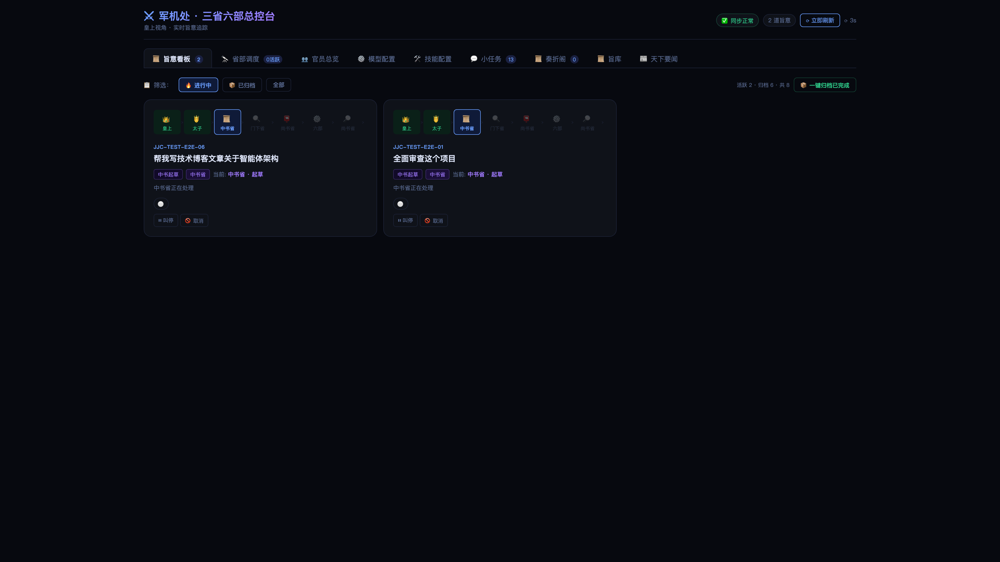

<details>
<summary>📸 More screenshots</summary>

### Agent Monitor
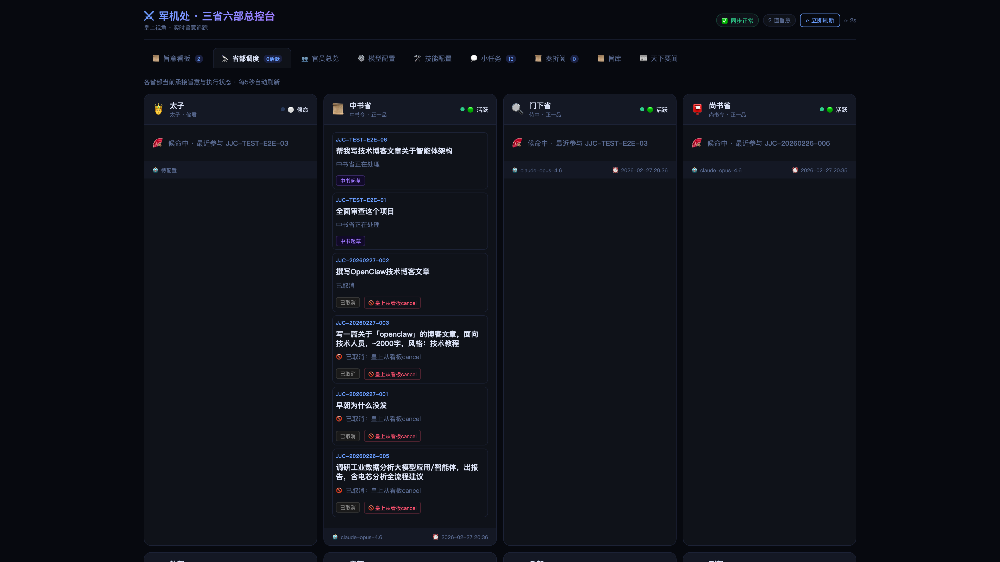

### Task Detail
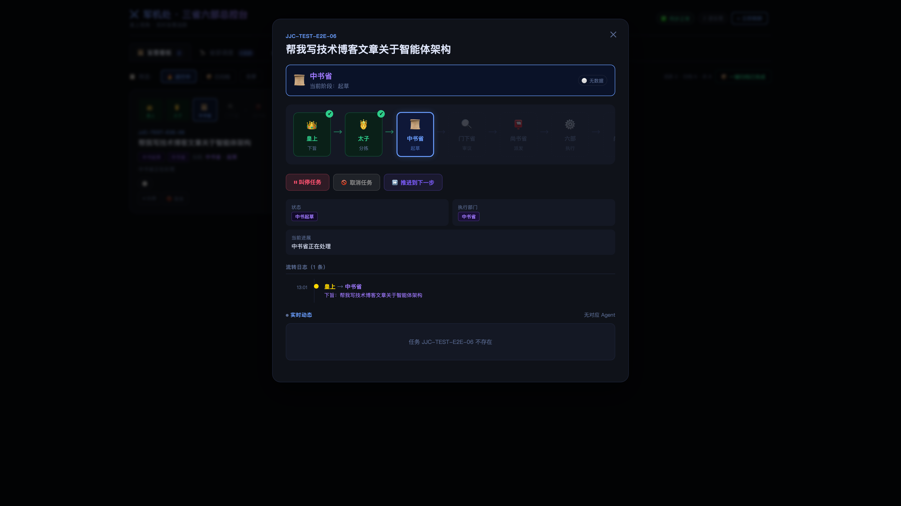

### Model Config
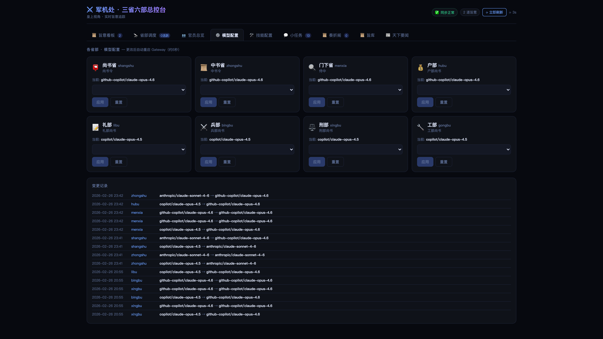

### Skills
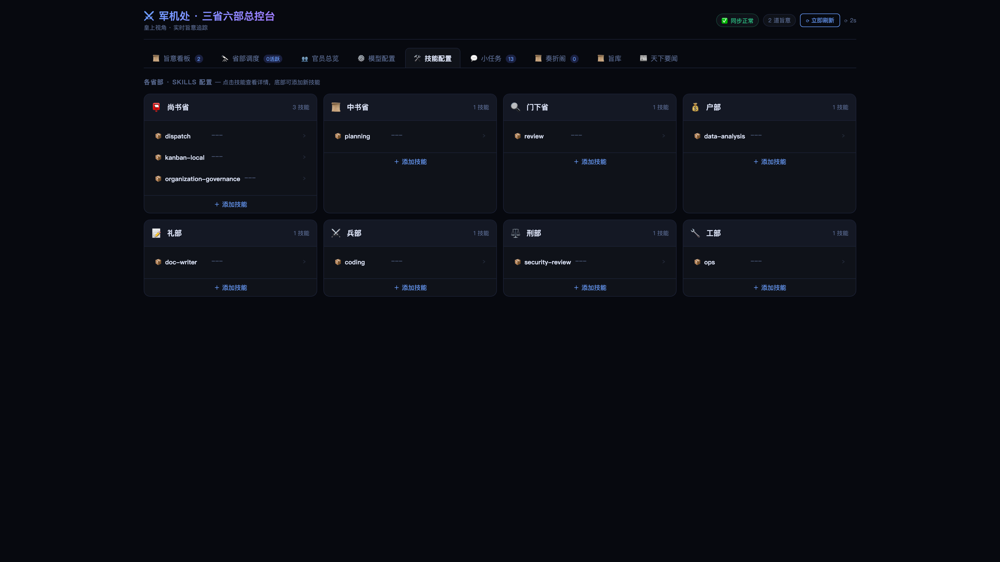

### Officials
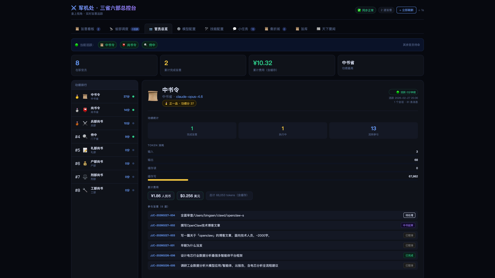

### Sessions
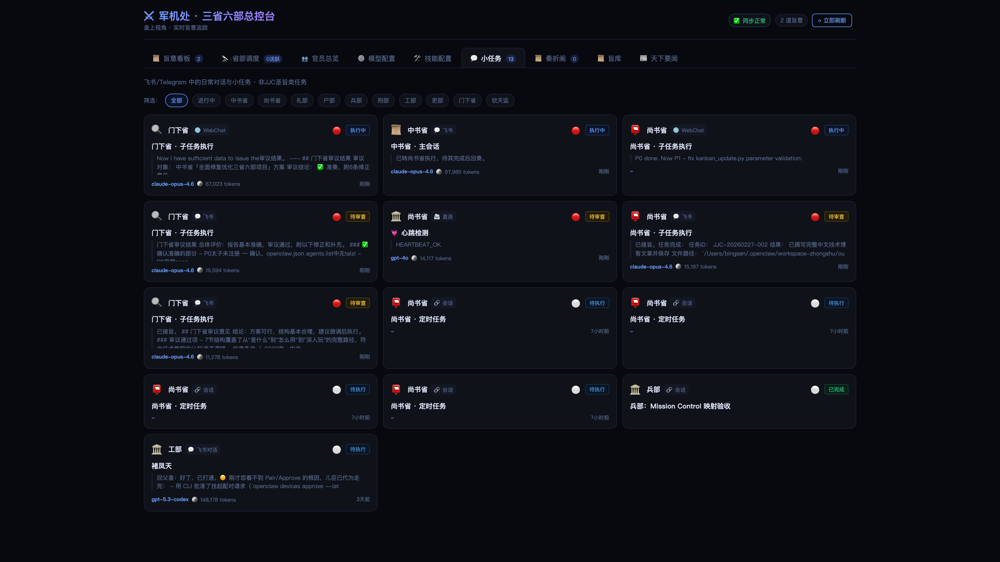

### Memorials Archive
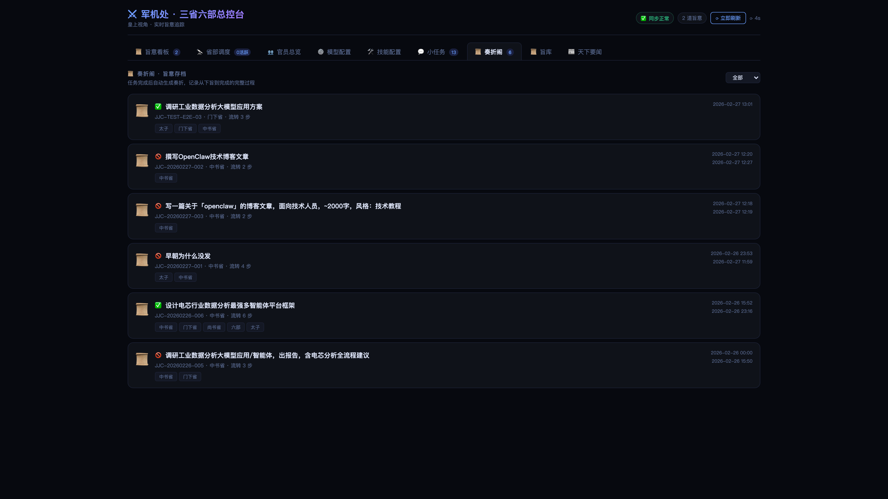

### Command Templates
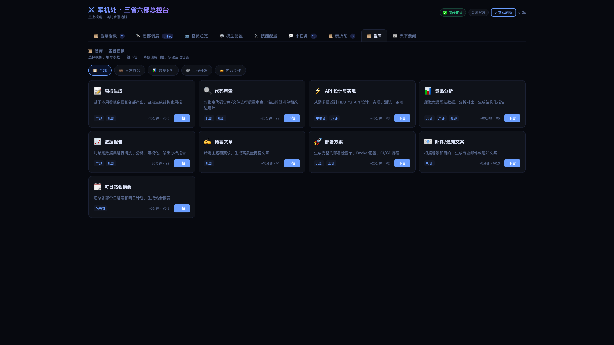

### Daily Briefing
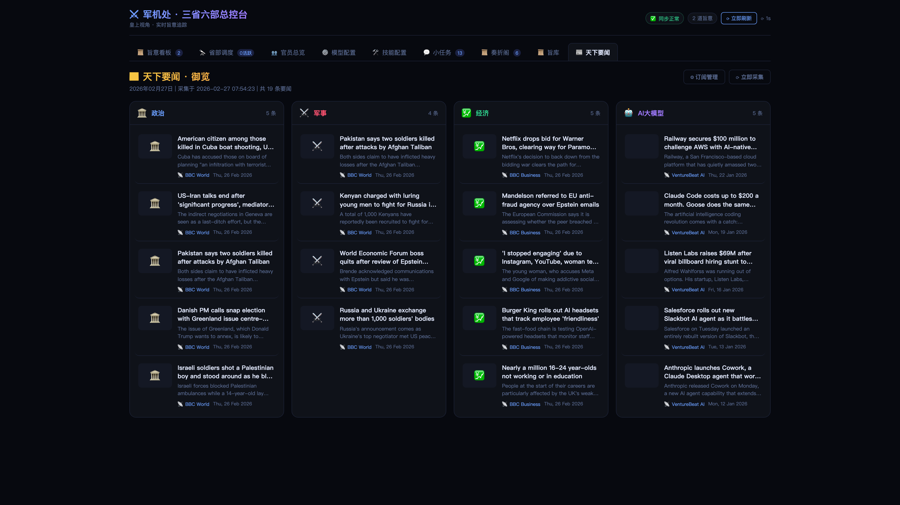

### Court Ceremony


</details>

---

## 🚀 Quick Start

### Compose (v2)

```bash
docker compose up -d --build
```
Open http://127.0.0.1:8002 (backend API: http://127.0.0.1:8001)

### Full Install

**Prerequisites:** [OpenClaw](https://openclaw.ai) · Python 3.11+ · macOS/Linux

```bash
git clone https://github.com/cft0808/edict.git
cd edict
docker compose up -d --build
```

Compose will start:
- FastAPI backend
- orchestrator / dispatcher workers
- PostgreSQL + Redis
- React frontend via Nginx

### Launch

```bash
docker compose up -d --build
open http://127.0.0.1:8002
```

> 📖 See [Getting Started Guide](docs/guides/getting-started.md) for detailed walkthrough.
>
> 🧱 See [Current Code Structure](docs/architecture/code-structure.md) for the `backend / kernel / frontend` layering.

---

## 🏛️ Architecture

```
                           ┌───────────────────────────────────┐
                           │         👑 Emperor (You)           │
                           │     Feishu · Telegram · Signal     │
                           └─────────────────┬─────────────────┘
                                             │ Issue edict
                           ┌─────────────────▼─────────────────┐
                           │     👑 Crown Prince (太子)          │
                           │   Triage: chat → reply / cmd → task │
                           └─────────────────┬─────────────────┘
                                             │ Forward edict
                           ┌─────────────────▼─────────────────┐
                           │      📜 Planning Dept (中书省)      │
                           │     Receive → Plan → Decompose      │
                           └─────────────────┬─────────────────┘
                                             │ Submit for review
                           ┌─────────────────▼─────────────────┐
                           │       🔍 Review Dept (门下省)       │
                           │     Audit → Approve / Reject 🚫     │
                           └─────────────────┬─────────────────┘
                                             │ Approved ✅
                           ┌─────────────────▼─────────────────┐
                           │      📮 Dispatch Dept (尚书省)      │
                           │   Assign → Coordinate → Collect     │
                           └───┬──────┬──────┬──────┬──────┬───┘
                               │      │      │      │      │
                         ┌─────▼┐ ┌───▼───┐ ┌▼─────┐ ┌───▼─┐ ┌▼─────┐
                         │💰 Fin.│ │📝 Docs│ │⚔️ Eng.│ │⚖️ Law│ │🔧 Ops│
                         │ 户部  │ │ 礼部  │ │ 兵部  │ │ 刑部 │ │ 工部  │
                         └──────┘ └──────┘ └──────┘ └─────┘ └──────┘
                                                               ┌──────┐
                                                               │📋 HR  │
                                                               │ 吏部  │
                                                               └──────┘
```

### Agent Roles

| Dept | Agent ID | Role | Expertise |
|------|----------|------|-----------|
| 👑 **Crown Prince** | `taizi` | Triage, summarize | Chat detection, intent extraction |
| 📜 **Planning** | `zhongshu` | Receive, plan, decompose | Requirements, architecture |
| 🔍 **Review** | `menxia` | Audit, gatekeep, veto | Quality, risk, standards |
| 📮 **Dispatch** | `shangshu` | Assign, coordinate, collect | Scheduling, tracking |
| 💰 **Finance** | `hubu` | Data, resources, accounting | Data processing, reports |
| 📝 **Documentation** | `libu` | Docs, standards, reports | Tech writing, API docs |
| ⚔️ **Engineering** | `bingbu` | Code, algorithms, checks | Development, code review |
| ⚖️ **Compliance** | `xingbu` | Security, compliance, audit | Security scanning |
| 🔧 **Infrastructure** | `gongbu` | CI/CD, deploy, tooling | Docker, pipelines |
| 📋 **HR** | `libu_hr` | Agent management, training | Registration, permissions |
| 🌅 **Briefing** | `zaochao` | Daily briefing, news | Scheduled reports, summaries |

### Permission Matrix

| From ↓ \ To → | Prince | Planning | Review | Dispatch | Ministries |
|:---:|:---:|:---:|:---:|:---:|:---:|
| **Crown Prince** | — | ✅ | | | |
| **Planning** | ✅ | — | ✅ | ✅ | |
| **Review** | | ✅ | — | ✅ | |
| **Dispatch** | | ✅ | ✅ | — | ✅ all |
| **Ministries** | | | | ✅ | |

### State Machine

```
Emperor → Prince Triage → Planning → Review → Assigned → Executing → ✅ Done
                              ↑          │                       │
                              └── Veto ──┘              Blocked ──
```

---

## 📁 Project Structure

```
edict/
├── agents/                     # 12 agent personality templates (SOUL.md)
│   ├── taizi/                  #   Crown Prince (triage)
│   ├── zhongshu/               #   Planning Dept
│   ├── menxia/                 #   Review Dept
│   ├── shangshu/               #   Dispatch Dept
│   ├── hubu/ libu/ bingbu/     #   Finance / Docs / Engineering
│   ├── xingbu/ gongbu/         #   Compliance / Infrastructure
│   ├── libu_hr/                #   HR Dept
│   └── zaochao/                #   Morning Briefing
├── backend/                    # FastAPI services + workers
├── frontend/                   # React dashboard frontend
├── kernel/                     # workflow kernel package
├── scripts/                    # v2 operational scripts
│   └── redeploy_v2.sh          #   v2 redeploy helper
├── tests/                      # v2 unit/integration tests
├── data/                       # Runtime data (gitignored)
├── docs/                       # Layered documentation and media
│   ├── architecture/           #   Architecture docs
│   ├── guides/                 #   How-to guides
│   ├── articles/               #   Articles and WeChat content
│   └── media/                  #   Screenshots, video, assets
├── AGENTS.md                   # Repo-level execution rules
└── LICENSE                     # MIT
```

---

## 🔧 Technical Highlights

| | |
|---|---|
| **React 18 Frontend** | TypeScript + Vite + Zustand with multi-panel dashboard |
| **Backend services** | FastAPI + PostgreSQL + Redis (compose-ready) |
| **Agent Thinking Visible** | Real-time display of agent thinking, tool calls, results |
| **One-click Start** | `docker compose up -d --build` |
| **Event-driven Flow** | PostgreSQL + Redis + workers drive task transitions |
| **Daily Ceremony** | Immersive opening animation |

---

## 🗺️ Roadmap

> Full roadmap with contribution opportunities: [ROADMAP.md](ROADMAP.md)

### Phase 1 — Core Architecture ✅
- [x] Twelve-department agent architecture + permissions
- [x] Crown Prince triage layer (chat vs task auto-routing)
- [x] Real-time dashboard (10 panels)
- [x] Task stop / cancel / resume
- [x] Memorial archive (5-phase timeline)
- [x] Edict template library (9 presets)
- [x] Court ceremony animation
- [x] Daily news + Feishu webhook push
- [x] Hot-swap LLM models + skill management
- [x] Officials overview + token stats
- [x] Session monitoring
- [x] Edict data sanitization (title/remark cleaning, dirty data rejection)
- [x] Duplicate task overwrite protection
- [x] E2E kanban tests (17 assertions)

### Phase 2 — Institutional Depth 🚧
- [ ] Imperial approval mode (human-in-the-loop)
- [ ] Merit/demerit ledger (agent scoring)
- [ ] Express courier (inter-agent message visualization)
- [ ] Imperial Archives (knowledge base + citation)

### Phase 3 — Ecosystem
- [x] Docker Compose orchestration
- [ ] Pre-seeded demo image
- [ ] Notion / Linear adapters
- [ ] Annual review (yearly performance reports)
- [ ] Mobile responsive + PWA
- [ ] ClawHub marketplace listing

---

## 🤝 Contributing

All contributions welcome! See [CONTRIBUTING.md](CONTRIBUTING.md)

- 🎨 **UI** — themes, responsiveness, animations
- 🤖 **New agents** — specialized roles
- 📦 **Skills** — ministry-specific packages
- 🔗 **Integrations** — Notion · Jira · Linear · GitHub Issues
- 🌐 **i18n** — Japanese · Korean · Spanish
- 📱 **Mobile** — responsive, PWA

---

## � Examples

The `examples/` directory contains real end-to-end use cases:

| Example | Command | Departments |
|---------|---------|-------------|
| [Competitive Analysis](examples/competitive-analysis.md) | "Analyze CrewAI vs AutoGen vs LangGraph" | Planning→Review→Finance+Engineering+Docs |
| [Code Review](examples/code-review.md) | "Review this FastAPI code for security issues" | Planning→Review→Engineering+Compliance |
| [Weekly Report](examples/weekly-report.md) | "Generate this week's engineering team report" | Planning→Review→Finance+Docs |

Each case includes: Full command → Planning proposal → Review feedback → Ministry outputs → Final report.

---

## 📄 License

[MIT](LICENSE) · Built by the [OpenClaw](https://openclaw.ai) community

---

## 📮 WeChat · Behind the Scenes

> *In ancient China, the “Dǐbào” (imperial gazette) delivered edicts across the empire. Today we have a WeChat account.*

<p align="center">
  
  <br>
  <b>Scan to follow · cft0808</b>
</p>

What you’ll find:
- 🏛️ Architecture deep-dives — how 12 agents achieve separation of powers
- 🔥 War stories — when agents fight, burn tokens, or go on strike
- 💡 Token-saving tricks — run the full pipeline at 1/10 the cost
- 🎭 Behind the SOUL.md — how to write prompts that make AI agents stay in character

---

## ⭐ Star History

[](https://star-history.com/#cft0808/edict&Date)

---

<p align="center">
  <strong>⚔️ Governing AI with the wisdom of ancient empires</strong><br>
  <sub>以古制御新技，以智慧驾驭 AI</sub><br><br>
  <a href="#-wechat--behind-the-scenes"></a>
</p>
